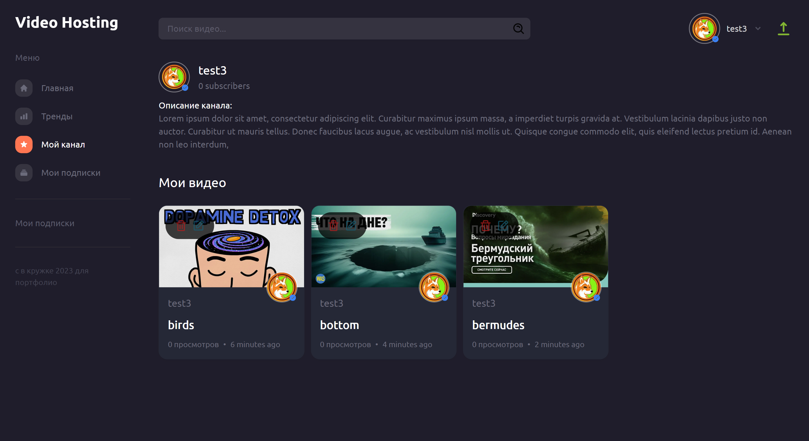
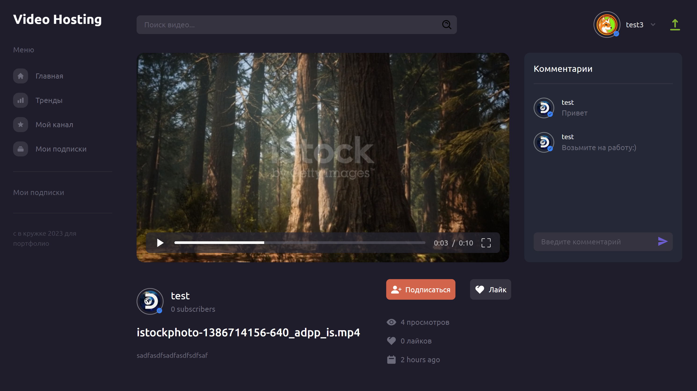
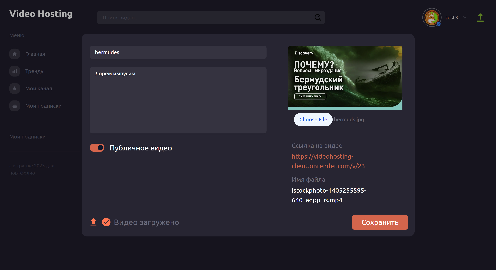

## Видеохостинг

TypeScript

Моя работа: Fullstack с 0.

>Ссылки на гитхаб:

>Клиент https://github.com/pirogHub/youtube-client

>Сервер: https://github.com/pirogHub/youtube-server

Краткое описание:
- Реализован сервис загрузки и редактирования видео и обложек
- Сервис создания и отправки комментариев под видео
- Сервис подписки на канал
- Видеоплеер для просмотра видео, обновление количества просмотров видео
- Запрос, обновление данных и кеширование через createApi
- Верстка и стили с помощью Tailwind
- Создание моделей PostgreSQL и связей между ними(н-р, user->videos = oneToMany, video->comments = oneToMany,..)
- Глубокий запрос сущностей из БД (через select и relations)

### Стек, технологии и проч:
>Сервер:
NestJS, accessToken, Доступ по ролям через кастомные Guards, TypeOrm

>Клиент:
CreateApi, Видеоплеер, Сервис комментариев под видео, Доступ к роутам по ролям, Tailwind, NextJS, Redux, Headless UI

>Database:
PostgreSQL

